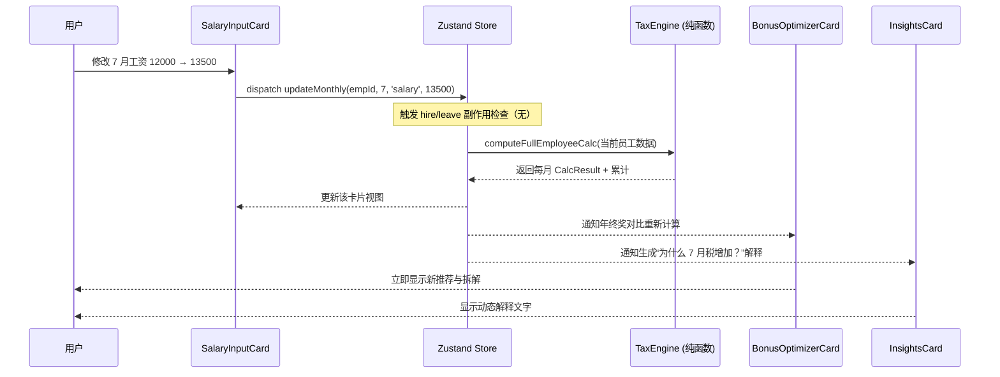
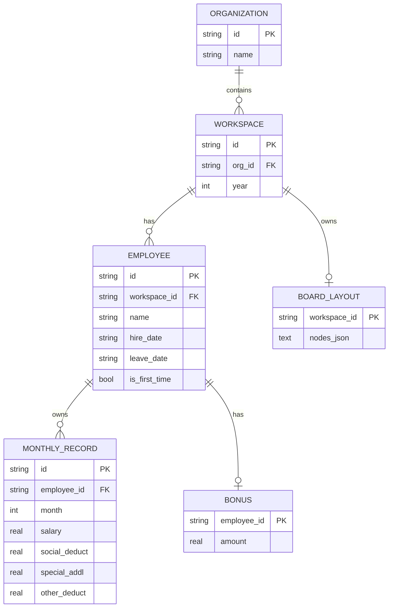

# 个人所得税预估与年终奖优化辅助工具设计文档

**项目名称**: Dude Tax  
**版本**: v1.0.0  
**日期**: 2026-06-11  
**状态**: 设计完成，准备从 0 开始实现  
**目标平台**: Windows 主力（Tauri 原生支持跨平台）  
**作者**: 系统架构师（Grok Build）  

本文档完整描述一个**全新本地单机桌面应用**的架构与实现计划。当前工作目录为干净文件夹，与任何既有项目无关。所有内容均基于用户明确需求：实时预估每月预扣个税、年终奖两种计税方式对比、支持多单位+按年份管理、入职/离职自动处理、美观柔和 glassmorphism 风格、100% 匹配国家税务总局累计预扣法与年终奖规则。

---

## 概述 (Overview)

本应用是一个专为单位人事人员设计的**本地参考与决策辅助工具**（非正式报税软件）。核心价值在于：

- 一次性录入或随时修改 1-12 月工资及主要扣除项，**即时**计算并展示每个月预扣税额。
- 提供年终奖“单独计税” vs “并入当年综合所得”两种方式的**税负对比 + 推荐 + 详细拆解说明**。
- 通过“无限画布 + 可拖拽功能卡片”实现灵活布局，类似 Miro 的自由排列体验。
- 严格遵守官方规则，支持入职/离职场景下的智能数据处理（自动清零 + 友好确认提示）。
- 完全离线、本地 SQLite 持久化，数据永不离开用户设备。

应用采用 **Tauri (Rust + Web 前端)** 实现，以获得极小安装体积（目标 < 15MB）、优秀的安全特性以及对敏感薪资数据的本地优先处理。前端使用 React + TypeScript + Tailwind，状态实时响应，税费引擎为纯函数实现。

文档后续章节将详细展开技术选型、数据模型、核心模块、UI 实现、测试策略、风险与 PR 拆分计划。

---

## 背景 (Background)

中国个人所得税采用**累计预扣预缴法**（工资薪金）+ **全年一次性奖金单独计税优惠政策**（延续至 2027-12-31）。人事在实际发薪前需要可靠的预估工具来规划薪酬结构、沟通员工到手金额、辅助年终奖申报决策。

现有工具问题：
- 官方扣缴计算器为网页/单次计算，无法批量 12 个月实时联动修改。
- Excel 模板易出错、无智能解释、无法很好处理入职/离职动态月份。
- 市面软件或联网或过于复杂，或不公开计算逻辑。

本应用填补“本地、美观、实时、解释清晰、严格对齐官方”的空白。特别针对“人事多为女性、喜欢柔和优雅界面”的反馈，采用 Morandi 蓝紫 + 温暖米白 + glassmorphism 设计。

重要业务规则直接来自官方（累计预扣预缴公式、首次取得工资人员累计减除费用从年初算起、年终奖 /12 确定税率等），详见 References。

---

## 目标与非目标 (Goals & Non-Goals)

### 核心目标 (Goals)
- **实时计算与刷新**：任何与税相关的输入（工资、专项扣除、专项附加扣除等）变更，**所有相关卡片**的税额、累计、解释立即自动更新（< 10ms 感知延迟）。
- **100% 计算准确**：税费引擎必须严格实现国家税务总局累计预扣预缴公式与年终奖规则。通过单元测试与手动官方计算器对齐用例验证（含边界、0 收入、跨税率档）。
- **入职/离职智能处理**：
  - 输入离职日期 → 弹出友好确认（如“你确认从 8 月起不再发放工资吗？”）→ 确认后 9-12 月工资/扣除自动清零，年终奖仍可正常录入。
  - 输入入职日期 → 自动将之前月份工资与扣除设为 0，并给出明显提示（如“该员工 6 月入职，之前月份已自动处理为无收入”）。
- **年终奖优化器**：提供两种计税方式并列对比（单独计税 vs 并入综合所得），给出推荐理由 + 税额差异 + 拆解说明（不包含按在职月份比例建议发放金额）。
- **多单位 + 按年份管理**：支持创建/切换多个“工作区”（单位 + 年份），数据完全隔离。
- **美观优雅 UI**：glassmorphism 卡片（半透明 + backdrop-blur + 柔和阴影），浅色 Morandi 配色，数据表格必须高可读性（实心高对比背景 + 等宽数字）。
- **智能辅助**：动态生成“为什么这个月税多了？”等解释，引用累计收入、税率档变化、扣除影响。
- **本地优先**：完全离线，SQLite 持久化，Tauri 小体积，敏感数据不联网。
- **从 0 开始可执行**：提供明确的项目脚手架命令、文件结构、核心模块（SalaryInputCard、BonusOptimizerCard、EmployeeRosterCard 等）、状态管理方案。

### 非目标 (Non-Goals，当前版本明确排除)
- 直接联网报税或对接税务系统。
- 多人协作编辑、实时同步。
- 移动端 / Web 版 / 完整 HR 系统对接。
- 政策自动更新提醒或规则热加载（当前硬编码 2026 规则 + 明确版本提示）。
- 漂亮 PDF 正式报告导出（未来可考虑简单 CSV/JSON 导出）。
- 按在职月份比例反推年终奖建议发放金额。
- 完整年度汇算清缴全流程模拟（仅预估 + 年终奖选择辅助）。

---

## 提议设计 (Proposed Design)

### 1. 整体技术架构

采用经典 Tauri 分层架构：Rust 后端负责本地持久化与系统能力，前端 Web 负责全部业务逻辑与绚丽 UI。税费引擎完全放在前端纯函数中，实现零延迟实时计算。

```mermaid
graph TB
    subgraph "用户设备 (Windows)"
        subgraph "Tauri 应用"
            subgraph "Rust 后端 (src-tauri)"
                DB[SQLite 插件 + 迁移<br/>appLocalDataDir()/tax-estimator.db]
                CMD[tauri::command<br/>loadWorkspace / saveMonthly / ...]
            end
            
            subgraph "前端 WebView (Vite + React)"
                UI[React + TS + Tailwind]
                subgraph "核心层"
                    STORE[Zustand Store<br/>响应式状态 + 派生计算]
                    ENGINE[纯函数税费引擎<br/>src/lib/tax/engine.ts]
                    EXPL[解释生成器<br/>explanations.ts]
                end
                subgraph "画布层"
                    FLOW[React Flow @xyflow/react<br/>无限画布 + 节点拖拽缩放]
                end
                subgraph "卡片组件"
                    ROSTER[EmployeeRosterCard]
                    SALARY[SalaryInputCard]
                    BONUS[BonusOptimizerCard]
                    INSIGHT[InsightsCard]
                    TAX[TaxSummaryCard]
                end
            end
        end
        
        USER[(人事用户)] -- 鼠标/键盘输入 --> UI
        UI -- 立即更新 --> STORE
        STORE -- 调用纯函数 --> ENGINE
        ENGINE -- 返回 CalcResult[] + Explanation --> STORE
        STORE -- 派生状态更新 --> 所有卡片
        STORE -- debounced --> CMD --> DB
        DB -- 查询 --> CMD --> STORE
    end
```

**关键数据流（实时刷新）**：



**入职/离职 + 确认提示 + 跨卡片（含年终奖）端到端完整流程**（新增序列图，覆盖 Issue 要求）：

```mermaid
sequenceDiagram
    participant U as 用户（Roster 或 SalaryInputCard）
    participant C as ConfirmModal (Glass 风格)
    participant S as Zustand Store
    participant E as TaxEngine (纯函数)
    participant B as BonusOptimizerCard
    participant SAL as SalaryInputCard / Roster
    participant I as InsightsCard

    U->>SAL: 在 SalaryInputCard 设置离职日期 2025-08-15
    SAL->>S: setLeaveDate(empId, '2025-08-15')
    S->>S: 计算 targetMonth=8，设置 pendingConfirm = {empId, type:'leave', targetMonth:8, proposedDate}
    Note over S: 立即派生状态变化，触发订阅者
    S-->>C: pendingConfirm 非空，Modal 自动弹出（通过 useEffect 订阅 store）
    C->>U: 显示专业提示：“你确认从 8 月起不再发放工资吗？（年终奖仍可正常录入）”
    U->>C: 点击“确认”
    C->>S: confirmPendingAction()
    S->>S: 零化 9-12 月 monthlyRecords[empId]（salary/special 等全 0）
    S->>S: 更新 employee.leave_date
    S->>S: db api persist (monthly + employee + layout)
    S->>S: pendingConfirm = null
    S->>E: computeFullEmployeeCalc（employmentMonthsUsed 仅到 8 月，isFirstTime 影响前置）
    E-->>S: 返回新 CalcResult[]（9-12 tax=0，累计稳定）
    S-->>SAL: 更新 SalaryInputCard（表格 9-12 清零 + 持久 banner “该员工 8 月离职，后续月份已自动处理”）
    S-->>B: 通知年终奖对比重新计算（因 employmentMonths 变化影响并入方案年度总税负基数）
    B-->>U: 立即刷新两种计税对比 + 推荐 + 拆解（使用 PR2 完整 explanations）
    S-->>I: 通知生成新解释（含离职影响）
    I-->>U: 显示“离职后累计不再增加，9 月起本期应预扣税额自动为 0”
    Note over S,SAL,B,I: 所有打开卡片（即使在画布不同节点）实时同步，无需手动刷新
```
（入职流程类似：setHireDate 设置 pending → 确认 → 零化之前月份 + 设置 isFirstTime 影响 → engine 使用日历月数计算基本减除 → 所有卡片更新。）

### 2. UI 风格与无限画布实现

**配色系统（CSS 变量，浅色优雅）**：
- 背景：`--bg: #F8F6F3`（温暖米白）
- 卡片玻璃：`--card-bg: rgba(255, 253, 250, 0.68)` + `backdrop-filter: blur(20px)`
- 主色 Morandi 蓝紫：`--primary: #6B7A8F`
- 强调暖米：`--accent: #9B8D7D`
- 文字：`--text: #3A3A3A` / `--text-muted: #6B6B6B`
- 表格内：实心 `--table-bg: #FFFFFF` + `border: 1px solid #E5E2DC`，数字使用 `font-family: ui-monospace, monospace`，高对比保证可读。

**GlassCard 基础组件**（所有功能模块外壳）：
```tsx
// src/components/common/GlassCard.tsx
<div className="
  glass-card relative rounded-2xl p-4
  bg-[var(--card-bg)] backdrop-blur-2xl
  border border-white/40 shadow-[0_8px_32px_rgb(0,0,0,0.06)]
  transition-all duration-200
">
  {/* 卡片标题栏 + 内容 */}
  {/* 内部表格必须有独立实心背景 */}
</div>
```

**无限画布**：使用 `@xyflow/react` (React Flow v12+)。
- 节点即卡片（自定义 Node 类型：`roster`、`salary-input`、`bonus-optimizer`、`insights`）。
- 支持自由拖拽、平移、滚轮/捏合缩放、迷你地图（可选）。
- 每个节点内部是完整功能（表格可滚动、输入实时）。
- 画布背景使用细点网格（subtle dots），营造“数字纸张”高级感。
- 布局持久化：workspace 维度存储 `nodes: [{id, type, position: {x,y}, data: {employeeId?}}]`。
- 工具栏：+ 添加员工卡片、恢复默认布局、重置缩放、导出当前画布截图（未来）。

**卡片建议清单**（可多开）：
- `EmployeeRosterCard`：员工列表、添加/删除、批量设置入职/离职、当前选中高亮。
- `SalaryInputCard`（按员工）：员工名 + 入职/离职日期输入 + 12 个月可编辑表格（工资、专项扣除、专项附加、其他）。表格变更立即触发全局重算。
- `TaxSummaryCard`：当前选中员工的 12 个月预扣税额表格 + 累计曲线（简单 SVG 或 Recharts 轻量）。
- `BonusOptimizerCard`：年终奖金额输入 + 两种方案并列表格 + 推荐徽章 + 详细拆解列表。
- `InsightsCard`：动态生成的智能解释（按月“为什么” + 全局建议）。

### 3. 税费引擎（纯函数，准确性核心）

位置：`src/lib/tax/engine.ts` + `brackets.ts` + `explanations.ts`

**必须 100% 对齐的公式**（直接翻译官方）：

累计预扣预缴应纳税所得额 = 累计收入 - 累计免税收入 - 累计减除费用 - 累计专项扣除 - 累计专项附加扣除 - 累计依法确定的其他扣除

本期应预扣预缴税额 = (累计预扣预缴应纳税所得额 × 预扣率 - 速算扣除数) - 累计减免税额 - 累计已预扣预缴税额

累计减除费用 = 5000 × “截至本月在本单位的任职受雇月份数”

**入职特殊规则**（国家税务总局公告 2020 年第 13 号）：
- 若员工为“当年首次取得工资薪金所得的居民个人”（isFirstTimeWageEarner），累计减除费用按 **5,000 × 当前日历月份数** 计算（而非仅从入职月起）。

**离职处理**：
- 离职月及之后月份 income=0、各项扣除=0。
- 年终奖仍可单独录入（可能在离职后发放）。

**年终奖两种方式**（财政部税务总局公告 2023 年第 30 号，延续至 2027）：

1. **单独计税**：
   - 应纳税额 = 年终奖金额 × 适用税率 - 速算扣除数
   - 适用税率：年终奖 / 12 查 **按月换算的综合所得税率表**

2. **并入综合所得**：
   - 将年终奖并入全年综合所得后，按年度税率表计算全年总税负。
   - 推荐逻辑：比较“单独计税总税负” vs “并入后年度总税负”，取低者。

**完整税率表**（硬编码在 brackets.ts，带版本注释）：

年度综合所得税率表（并入用）：
- ≤ 36,000：3% / 0
- 36,001–144,000：10% / 2,520
- 144,001–300,000：20% / 16,920
- 300,001–420,000：25% / 31,920
- 420,001–660,000：30% / 52,920
- 660,001–960,000：35% / 85,920
- > 960,000：45% / 181,920

按月换算表（单独年终奖用）：
- ≤ 3,000：3% / 0
- 3,001–12,000：10% / 210
- 12,001–25,000：20% / 1,410
- 25,001–35,000：25% / 2,660
- 35,001–55,000：30% / 4,410
- 55,001–80,000：35% / 7,160
- > 80,000：45% / 15,160

**引擎 API 示例**（代码片段，中文注释）：

```ts
// src/lib/tax/engine.ts
import { ANNUAL_BRACKETS, MONTHLY_BONUS_BRACKETS } from './brackets';

export interface MonthInput {
  salary: number;           // 税前工资收入（元）
  socialDeduct: number;     // 专项扣除（三险一金个人）
  specialAddl: number;      // 专项附加扣除合计
  otherDeduct: number;
}

export interface EmployeeCalcInput {
  hireMonth: number;        // 1-12
  leaveMonth?: number;
  isFirstTime: boolean;
  months: MonthInput[];     // length === 12
  bonus?: number;
}

/** 计算 1-12 月累计预扣结果（严格官方公式） */
export function computeMonthlyPrewithhold(
  input: EmployeeCalcInput
): Array<{
  month: number;
  cumTaxable: number;
  thisMonthTax: number;
  cumTax: number;
  employmentMonthsUsed: number;
}> {
  // 实现细节：顺序遍历 1-12，应用入职/离职规则计算 employmentMonthsUsed
  // 仅在职月份计入收入与扣除
  // 使用 binarySearch 查表 getBracket(taxable, isAnnual)
  // 返回完整 trace 用于解释生成
}

/** 年终奖单独计税 */
export function computeBonusSeparateTax(bonus: number): number {
  const avg = bonus / 12;
  const bracket = MONTHLY_BONUS_BRACKETS.find(...);
  return Math.max(0, bonus * bracket.rate - bracket.quick);
}

/** 并入综合所得后的边际影响（年度总税 - 无奖金年度总税） */
export function computeMergedBonusTaxImpact(
  totalWageTaxable: number,   // 全年工资累计应纳税所得额（已扣除基本+专项等）
  bonus: number,
  totalAnnualDedsBeyondBasic: number
): { totalTaxWithBonus: number; incrementalTax: number } { ... }

/** 动态生成解释（引用累计与档位变化） */
export function generateWhyThisMonth(
  prev: CalcRow,
  curr: CalcRow
): string {
  // 示例输出：“本月累计应纳税所得额 38,200 元进入 10% 税率档（上一月为 29,400 元仍为 3%），
  // 速算扣除数调整，本期应预扣税额增加 312 元。主要因为累计收入突破 36,000 元临界点。”
}
```

**准确性保障**：
- 所有引擎函数必须为**纯函数**（无副作用、无 DOM、无 store）。
- `vitest` 测试文件 `engine.test.ts` 必须包含：
  - 标准全年工资 10,000 元/月、无额外扣除、全年就业 → 各月 thisMonthTax 断言（与官方计算器一致）。
  - 6 月入职 + isFirstTime=true → 6 月基本减除 = 6×5000。
  - 8 月离职 → 9-12 月 income=0，税=0。
  - 边界税率档切换、bonus 单独 vs 合并临界值（36k、144k 等）。
  - 浮点安全：内部全部金额转为“分”（*100 为整数运算），最终 /100 显示。

### 4. 状态管理与实时性

使用 **Zustand**（轻量、TS 友好、无 boilerplate）。

`src/stores/useTaxStore.ts`：
- `currentWorkspace: {orgId, year}`
- `employees: Record<string, Employee>`
- `monthlyRecords: Record<string, MonthInput[]>` （key = employeeId）
- `bonusRecords: Record<string, number>`
- `boardLayout: { nodes: FlowNode[] }`
- **`pendingConfirm: { employeeId: string; type: 'hire' | 'leave'; targetMonth: number; proposedDate: string } | null`** （待确认状态，驱动 ConfirmModal 显示）
- actions: `updateMonthly(...)`, `setHireDate(employeeId, dateStr)` （**设置 pendingConfirm 而非直接执行**）、`setLeaveDate(...)` 同、`confirmPendingAction()`（执行零化 + persist + 清 pending + recompute + toast + banner）、`cancelPendingAction()`、`setIsFirstTime(employeeId, flag)`、`switchWorkspace(...)` 等。
- selectors: `useEmployeeCalc(employeeId)` （内部调用 engine，memoized）。
- 变更后自动 `debounceSaveToDb()`（500ms）。

**入职/离职 + 确认机制伪代码（store 实现必须严格遵循）**：
```ts
setLeaveDate(empId: string, dateStr: string) {
  const month = dateToMonth(dateStr);
  this.pendingConfirm = { employeeId: empId, type: 'leave', targetMonth: month, proposedDate: dateStr };
  // 不立即零化，由 modal confirm 触发
}
confirmPendingAction() {
  const p = this.pendingConfirm; if (!p) return;
  // 1. 零化受影响月份的 monthlyRecords[p.employeeId][month..12]
  // 2. 更新 employee leave/hire date + isFirstTime 影响
  // 3. persist via db api
  // 4. clear pending
  // 5. 强制 selector 重新 compute（触发所有订阅卡片刷新，包括 BonusOptimizer 因 employmentMonths 变化）
  // 6. 派发 toast + 在 SalaryInputCard/Roster 显示持久 banner
  this.pendingConfirm = null;
}
```
入职/离职副作用必须在 store action 中实现（而非 UI），保证无论从哪个卡片触发都一致。PR 4 提供骨架（可用 window.confirm 临时桩），PR 5 接入真实 Glass ConfirmModal，PR 10 完成全流程。

### 5. 持久化方案

- 使用 `@tauri-apps/plugin-sql`（推荐）或 rusqlite 命令。
- 数据库文件：`%APPDATA%\tax-estimator\tax-estimator.db`（或 appLocalDataDir）。
- Schema（主要表）：

```sql
CREATE TABLE organizations (id TEXT PRIMARY KEY, name TEXT NOT NULL, created_at TEXT);
CREATE TABLE workspaces (id TEXT PRIMARY KEY, org_id TEXT, year INTEGER, UNIQUE(org_id, year));
CREATE TABLE employees (
  id TEXT PRIMARY KEY,
  workspace_id TEXT,
  name TEXT NOT NULL,
  hire_date TEXT,           -- '2025-06-01' 或简化为 month 1-12
  leave_date TEXT,
  is_first_time INTEGER DEFAULT 0
);
CREATE TABLE monthly_records (
  id TEXT PRIMARY KEY,
  employee_id TEXT,
  month INTEGER CHECK(month BETWEEN 1 AND 12),
  salary REAL,
  social_deduct REAL,
  special_addl REAL,
  other_deduct REAL,
  UNIQUE(employee_id, month)
);
CREATE TABLE bonuses (employee_id TEXT PRIMARY KEY, amount REAL);
CREATE TABLE board_layouts (
  workspace_id TEXT PRIMARY KEY,
  nodes_json TEXT   -- 序列化 React Flow nodes
);
```

- 启动时执行迁移（Rust 侧 `migrations/` 目录或简单 `CREATE IF NOT EXISTS`）。
- 前端通过 `invoke('load_workspace', {orgId, year})` 等命令交互。
- 备份策略：用户可直接复制 .db 文件；应用提供“导出当前工作区 JSON”。

### 6. 项目文件结构（从 0 开始建议）

```
# 在干净目录 (D:\coding\dude-tax2) 执行 create 后
D:\coding\dude-tax2/
├── src-tauri/
│   ├── Cargo.toml
│   ├── src/
│   │   ├── main.rs
│   │   ├── commands.rs         # 所有 tauri::command
│   │   └── db.rs               # 连接池 + 迁移
│   └── tauri.conf.json
├── src/
│   ├── main.tsx
│   ├── App.tsx                 # 顶层：WorkspaceSwitcher + Canvas + Toaster
│   ├── components/
│   │   ├── common/
│   │   │   ├── GlassCard.tsx
│   │   │   ├── ConfirmModal.tsx
│   │   │   └── NumberInput.tsx
│   │   ├── cards/
│   │   │   ├── EmployeeRosterCard.tsx
│   │   │   ├── SalaryInputCard.tsx
│   │   │   ├── BonusOptimizerCard.tsx
│   │   │   ├── InsightsCard.tsx
│   │   │   └── TaxSummaryCard.tsx
│   │   └── canvas/
│   │       └── TaxCanvas.tsx   # ReactFlow 封装
│   ├── lib/
│   │   ├── tax/
│   │   │   ├── brackets.ts
│   │   │   ├── engine.ts
│   │   │   ├── explanations.ts
│   │   │   └── engine.test.ts
│   │   ├── utils/              # 新增：日期转换等工具
│   │   │   └── date.ts
│   │   ├── store/
│   │   │   └── useTaxStore.ts
│   │   └── db/
│   │       └── api.ts          # 封装 invoke
│   └── types/
│       └── index.ts
├── package.json
├── tailwind.config.ts
└── README.md                   # 包含完整 Windows 复制块 + “如何从 0 启动” + “验证准确性步骤”
```

**初始化命令**（设计中必须执行，Windows 优先完整可复制粘贴块）：

在执行任何命令前，必须确认当前目录为干净空文件夹（本项目指定为 `D:\coding\dude-tax2`）：

```powershell
# === Windows PowerShell / 命令提示符 完整可复制块 ===
# 1. 切换到干净目录（务必确认 D:\coding\dude-tax2 为空，无 node_modules、package.json 等任何文件）
cd D:\coding\dude-tax2

# 2. 使用 pnpm 创建 Tauri + React + TS 项目（推荐 pnpm 以获得最佳 Windows 体验）
pnpm create tauri-app@latest . -- --template react-ts

# 3. 如果上一步使用了 npm create 并产生了 package-lock.json，清理它：
# del package-lock.json 2>$null; if (Test-Path node_modules) { Remove-Item -Recurse -Force node_modules }

# 4. 安装依赖（pnpm 更快且推荐）
pnpm install

# 5. 安装核心运行时与开发依赖（Zustand、React Flow、Tauri SQL、图标、Toast、日期、测试）
pnpm add zustand @xyflow/react @tauri-apps/plugin-sql lucide-react sonner date-fns
pnpm add -D vitest @testing-library/react @testing-library/jest-dom

# 6. 立即验证脚手架（应启动空白窗口）
pnpm tauri dev
```

更新后的 `package.json` scripts 和 `README.md`（PR 1 生成）必须包含以上完整块 + “确保目录为空后执行”说明。文件树注释更新为：
```
# 在干净目录 (D:\coding\dude-tax2) 执行 create 后
```

---

## 数据模型 (Data Model)

**ER 图**（Mermaid，专业中文 + 英文对照规范）：



**前端运行时类型**（`src/types/index.ts`）与 DB 基本一致，增加计算结果类型 `EmployeeCalcResult`（不持久化，仅内存）。

**图例与语言规范（编码与图表语言规范）**：
- 表名/字段保留英文（SQL 与 TS 生态标准，便于直接 copy-paste 实现）。
- 中文映射：ORGANIZATION = 组织/单位表；WORKSPACE = 工作区（单位+年份）；EMPLOYEE = 员工表；MONTHLY_RECORD = 月度记录表；BONUS = 年终奖表；BOARD_LAYOUT = 画布布局表；id = 主键；hire_date = 入职日期（TEXT 'YYYY-MM-DD'）；is_first_time = 是否当年首次取得工资薪金所得居民个人（对应 2020 年第 13 号公告）。
- 架构图与序列图优先使用专业中文标签（子图、参与者、动作描述），技术名词在括号内保留英文（如 React Flow）。
- 所有 JSDoc、行内注释、示例输出字符串必须使用专业中文。
- 本规范同时写入 Key Decisions 并作为 PR 实现检查项。

金额存储建议：数据库用 REAL（双精度足够），但引擎内部统一 `Math.round(amount * 100)` 转“分”进行所有算术，最后 `/100` 展示，避免 0.1 + 0.2 类问题。

---

## 关键决策 (Key Decisions)

1. **Tauri (Rust+Web) 而非 Electron**：安装体积小 5-10 倍、内存占用低、Rust 内存安全极适合处理薪资敏感数据、原生菜单/文件对话框体验佳。量化：典型 Tauri 打包后 exe + assets < 15MB。

2. **React Flow 实现无限画布**：业界标准，支持自定义节点内容、拖拽、缩放、序列化布局。避免从零实现复杂手势与性能问题。权衡：增加 ~150kB 依赖，但换来极高开发效率与稳定性。

3. **税费引擎纯前端 TS 纯函数**：输入变化零网络/进程间延迟（关键实时性需求）。测试极易与官方公式对齐。Rust 引擎备选因跨语言序列化开销与测试复杂性被放弃。

4. **Zustand 作为唯一状态源**：比 Redux 轻 90% 代码量，支持细粒度 selector + immer 式更新，完美匹配“输入即重算所有视图”的需求。

5. **SQLite + Tauri plugin-sql**：可靠的本地文件数据库、易备份（直接 copy .db）、支持事务与未来复杂查询。比纯 JSON 文件或 IndexedDB 更适合桌面财务数据。

6. **Glassmorphism + 表格实心背景分离策略**：满足“美观柔和不枯燥”同时保证“数据表格和数字区域清晰易读”。WCAG AA 对比度硬性要求写入组件规范。

7. **内部金额以“分”为单位整数运算**：税局要求精确到分。使用 `number` + `*100` / `Math.round` 组合，杜绝浮点累积误差。未来可升级 decimal.js 如有更高精度需求。

8. **硬编码当前税率表 + 明确政策有效期**：避免“自动更新”带来的法律风险与复杂性。应用启动时在 About 页与计算结果页显示“基于 2026 年规则（年终奖单独计税优惠至 2027-12-31）”。未来 PR 可增加配置加载。

9. **Store 内实现入职/离职副作用 + UI 确认**：保证数据一致性（无论从 Roster 还是 SalaryCard 操作）。确认对话使用可复用的 Glass 风格 Modal。

10. **每个 PR 必须包含测试或验证步骤**：引擎测试、组件快照/交互测试、端到端手动 checklist（加载示例数据 → 修改 → 与官方计算器比对）。

11. **编码与图表语言规范**：代码标识符与 Mermaid ER 语法保留英文（生态标准）；架构/序列图、PR 描述、注释、用户可见字符串、图例全部使用专业中文。新增 `src/lib/utils/date.ts` 等工具文件时必须遵循此规范。此决策确保“输出整个设计文档使用中文”要求在实现阶段持续落地。

---

## 备选方案考虑 (Alternatives Considered)

- **Electron**：被否。体积大（>120MB）、Chromium 安全面大、内存占用高，不符合“轻量安全处理敏感薪资数据”要求。
- **自研 Canvas + @use-gesture + framer-motion**：被否。实现拖拽、缩放、节点内部复杂交互、序列化、性能优化成本极高，远超 React Flow 一个月工作量。
- **Redux Toolkit + RTK Query**：被否。过度设计，对于单机桌面 12 个月×N 员工的数据规模，Zustand 已完全足够且更简单。
- **纯 Rust + egui / Dioxus 前端**：被否。生态与美观组件（glass、复杂表格、拖拽画布）远不如 React+Tailwind 成熟，人事用户更熟悉 Web 风格交互。
- **IndexedDB (前端直存)**：被否。Tauri 环境下 SQLite 通过 Rust 插件更可靠、可直接被用户文件浏览器看到并备份。
- **固定多 Tab / 侧边栏布局**：被否。不满足“可自由拖拽、缩放、排列的功能模块卡片”需求。无限画布提供未来扩展性（可同时打开 3 个员工的完整卡片组进行对比）。

---

## 安全 (Security)

- **数据本地化**：所有薪资数据仅存在用户设备 SQLite 文件中。无任何后端、无 telemetry、无自动上报。
- **Tauri 能力最小化**：`tauri.conf.json` 中仅允许 `fs: { scope: ['$APPDATA/**'] }`、`dialog`（保存导出）、无 `shell` 任意执行。
- **输入校验**：前端使用 zod 严格 schema 校验所有用户输入（金额 ≥0、月份 1-12 等）。后端命令也做二次校验。
- **计算透明**：所有税额均来自开源可见的纯函数，用户可审查 engine.ts。
- **发布安全**：Windows 构建必须代码签名（未来）。提供 SHA256 校验和。
- **风险缓解**：应用内常驻免责声明“仅供参考，请以税务机关官方计算器与最终汇算为准”。提供一键“导出当前工作区 JSON”便于审计/备份。
- **离职/清零操作**：必须二次确认，防止误操作导致数据丢失（虽可通过历史备份恢复）。

---

## 可观测性 (Observability)

- **本地日志**：使用 `tauri-plugin-log`（或自定义文件 logger），区分 info / warn / error。关键事件：工作区切换、大量清零操作、计算异常。
- **React ErrorBoundary + 友好提示**：捕获渲染或计算异常，显示“计算出现问题，请检查输入数值是否合理” + “重置此员工数据”按钮，同时记录堆栈到日志。
- **内置验证工具**（开发与高级用户可见）：加载预置示例数据集（全职 8000/10000/15000 元场景 + 入职 6 月 + 离职 8 月 + 边界奖金），一键与已知官方结果比对。
- **性能监控**：计算函数包裹 `performance.mark`，开发模式 console 输出“tax-recompute: 3.2ms”。生产可通过设置菜单开启。
- **无远程上报**：完全符合本地隐私要求。用户可通过“帮助 → 导出诊断信息”手动提供日志给开发者。

---

## 上线与演进 (Rollout)

采用 PR 驱动的增量交付（详见 PR Plan）：

1. **脚手架 + 引擎 + 基础持久化**（PR 1-3）：可运行的命令行验证税计算准确性。
2. **核心交互 MVP**（PR 5-10，包括 PR 7a/7b 画布基础与真实卡片集成）：真实可输入 12 个月、实时看到税额变化、年终奖对比可用。
3. **完整验证 + 发布**（PR 11-12）：端到端测试、示例数据、官方计算器对齐 + Windows 打包与最终文档。
4. **打包与试点**：`tauri build --target x86_64-pc-windows-msvc`，生成 .msi / .exe 安装包。邀请 2-3 名人事试点，重点验证：
   - 与官方扣缴计算器结果一致性（至少 5 个真实薪资场景）。
   - 入职/离职自动处理是否符合预期。
   - 界面是否“美观不枯燥”。
5. **反馈迭代**：收集后进入下一轮小 PR（CSV 导入、更多扣除细项、键盘快捷键等）。
6. **长期**：政策变化时以大版本方式更新 brackets + 发布说明。提供“历史年度”只读模式。

成功指标（量化）：
- 单个员工全量重算 < 5ms。
- 支持单工作区 100 名员工无明显卡顿。
- 打包后 Windows 安装体积 < 15 MB。
- 试点用户 90% 认为“计算结果可信”。

---

## 开放问题 (Open Questions)

1. 专项附加扣除是否需要拆分子项输入（子女教育 2000/月、住房贷款利息、赡养老人等）以便未来扩展自动累计？当前版本先支持“专项附加合计”手动录入。
2. 多单位年终奖场景：是否在 BonusOptimizerCard 中增加警告“根据政策，同一纳税年度只能选择一笔全年一次性奖金单独计税”？
3. 是否持久化“已实际预扣税额”（允许用户手动覆盖引擎结果以匹配真实发薪记录与后续汇算差异）？
4. 画布是否需要持久化当前 viewport（zoom、pan 位置），还是仅节点位置？
5. 未来是否支持从 Excel/CSV 批量导入 12 个月数据？（当前仅手动 + 单个 JSON 导出导入）
6. 金额显示默认“元”还是同时显示“元 / 分”？是否增加“千分位 + 红色负数”格式选项？
7. 是否在 InsightsCard 中增加“本年度累计预扣 vs 年度汇算预估退补税”简单模拟（需假设全年其他收入为 0）？
8. 离职后年终奖发放月份是否影响预扣？（当前简化：年终奖独立于月度预扣）。

以上问题建议在首个 MVP 落地后通过用户访谈或试点反馈确定优先级。

---

## 参考 (References)

- 国家税务总局关于完善调整部分纳税人个人所得税预扣预缴方法的公告（2020 年第 13 号）。
- 财政部 税务总局关于延续实施全年一次性奖金个人所得税政策的公告（2023 年第 30 号）。
- 《个人所得税税率表（综合所得适用）》及《按月换算后的综合所得税率表》（国税发〔2005〕9 号及后续衔接文件）。
- 累计预扣预缴计算公式官方解读：https://www.gerensuodeshui.cn/ 等税务局认可渠道（[web:0]、[web:1]、[web:10]、[web:14]）。
- Tauri 官方文档：https://tauri.app/ （v2 插件系统、SQL 插件）。
- React Flow 文档：https://xyflow.com/react-flow （节点自定义、序列化）。
- Zustand 文档与最佳实践。

---

## PR Plan

以下 PR 列表按**严格执行顺序**排列。每个 PR 都是**可独立评审、独立合并**的增量交付，包含清晰的范围、影响文件、依赖前置 PR、变更描述、验收标准和测试要求。PR 标题使用中文（与项目沟通语言一致）。

每个 PR 完成后，代码库必须能通过 `tauri dev` 启动，且对应功能可手动验证。

### PR 1: 初始化 Tauri + React + Tailwind 脚手架与基础样式系统

**影响文件/组件**:
- 整个根目录新生成文件（Cargo.toml、tauri.conf.json、src-tauri/src/main.rs、src/App.tsx、src/main.tsx、package.json、tsconfig 等）。
- 新增 `src/styles/globals.css`（定义所有 CSS 变量、.glass-card 基础类、表格基础样式，包含 --card-bg / backdrop-blur + 实心 --table-bg 保证数字清晰，Morandi 配色变量，表格 monospace）。
- 新增 `tailwind.config.ts` + `postcss.config`。
- 更新 `src-tauri/tauri.conf.json`（窗口标题 “Dude Tax”、最小尺寸、Windows 图标占位）。
- 新增 `README.md`（从 0 开始启动 + 精确 D:\coding\dude-tax2 的 Windows 完整复制粘贴块，pnpm tauri dev 验证）。

**依赖关系**: 无（本 PR 为所有后续基础）。

**变更简述**:
在干净目录 D:\coding\dude-tax2 执行 pnpm create tauri-app@latest . -- --template react-ts，清理多余文件，集成 Tailwind，定义玻璃拟态基础（GlassCard 原型 + 实心表格背景保证可读性 + Morandi 变量）。添加 sonner Toaster 占位。配置 Windows 构建。README 必须包含完整 Windows 复制粘贴块（cd D:\coding\dude-tax2、pnpm create、清理、pnpm install、add 依赖、pnpm tauri dev）。确保 tauri dev 可启动带玻璃质感空白窗口。

**验收标准**:
- 应用启动无错误，窗口标题正确。
- 能看到使用 --card-bg 与 backdrop-blur 的占位卡片，表格内数字使用 monospace 高对比度样式。
- README 包含完整“从干净目录开始” + 精确 D:\coding\dude-tax2 Windows 复制粘贴块。
- pnpm tauri dev 验证通过。

### PR 2: 纯函数税费引擎 + brackets + 完整解释生成器 + date utils + Vitest 测试套件

**影响文件/组件**:
- `src/lib/tax/brackets.ts`
- `src/lib/tax/engine.ts`（computeMonthlyPrewithhold、computeBonusSeparateTax、computeMergedBonusTaxImpact 等核心纯函数）。
- `src/lib/tax/explanations.ts`（完整实现 generateWhyThisMonth + bonus 拆解 + 中文示例字符串）。
- `src/lib/utils/date.ts`（dateToMonth、deriveEmploymentMonths、isFirstTime 处理）。
- `src/lib/tax/engine.test.ts`（≥18 个用例，含新入职/离职/奖金边界 + 解释中文输出精确断言）。
- `src/types/index.ts`（Calc 相关类型）。

**依赖关系**: 无（或仅依赖 PR 1 的 TS 环境与测试 runner）。

**变更简述**:
完整实现官方累计预扣法公式（含 isFirstTime 规则、离职月份处理）。实现查表函数（年度表 + 按月奖金表）。完整实现解释生成器（generateWhyThisMonth + 年终奖两种计税详细拆解，支持引用税率档、累计收入、employmentMonths 变化，输出专业中文）。新增 date utils 转换工具。添加 vitest 配置。编写 ≥18 个测试用例（标准案例、6月入职首次就业、8月离职、税率档跨越、年终奖 36000/100000 边界、0 工资 + 解释输出精确匹配中文断言）。所有金额内部 *100 处理。PR 2 完成后即可在后续卡片中直接使用完整解释功能进行手动验证。

**验收标准**:
- `pnpm test` 全部通过。
- 至少 3 个用例的 thisMonthTax / bonusTax 结果与 https://www.gerensuodeshui.cn/ 官方计算器手动比对一致（记录在测试注释）。
- 解释函数测试：给定特定累计 trace，generateWhyThisMonth 输出必须包含“累计应纳税所得额 XXX 元进入 XX% 税率档”或等价专业中文拆解；年终奖拆解必须能生成“单独计税使用 10% 档，并入后推高全年至 20% 档”风格文字。
- 引擎文件无任何副作用（可被 import 直接调用）。
- 转换工具（dateToMonth、deriveEmploymentMonths）有单元测试覆盖。

### PR 3: SQLite 持久化层 + Tauri 命令 + Schema + 基本 repositories

**影响文件/组件**:
- `src-tauri/Cargo.toml`（添加 tauri-plugin-sql 依赖）。
- `src-tauri/src/db.rs`、`src-tauri/src/commands.rs`、`src-tauri/src/main.rs`（注册插件与命令）。
- `src/lib/db/api.ts`（前端封装 invoke）。
- `src-tauri/migrations/` 或启动时 schema SQL。
- `tauri.conf.json` 权限配置（fs 作用域）。

**依赖关系**: 依赖 PR 2（用于类型）。

**变更简述**:
集成 `@tauri-apps/plugin-sql`，实现连接 appLocalDataDir 下的 db。定义完整 schema（organizations、workspaces、employees、monthly_records、bonuses、board_layouts），实现 Rust 侧或 JS 侧迁移。提供命令：create_org、get_workspaces、load_employees_and_records、save_monthly_record、save_board_layout 等。实现简单事务封装与基本 CRUD repositories。

**验收标准**:
- 应用启动时自动创建/迁移数据库。
- 通过 tauri dev 能从前端 invoke 成功读写一条员工 + 12 个月记录 + 布局。
- .db 文件出现在预期 app data 目录，schema 与 ER 一致。

### PR 4: Zustand store（含 pendingConfirm + 核心动作 + 骨架）

**影响文件/组件**:
- `src/stores/useTaxStore.ts`（完整 store 定义、selectors、actions，pendingConfirm: {employeeId, type:'hire'|'leave', targetMonth, proposedDate} | null + setSalary、setDeduction、setLeaveDate（仅设置 pending）、confirmPendingAction（零化 + persist + 清 pending + recompute + notify + banner）等）。
- `src/lib/db/api.ts` 扩展（load/save 集成）。
- `src/types/index.ts` 补充 Workspace/Employee 等。
- 简单 WorkspaceSwitcher 组件原型（下拉 + 新建）。
- 基本卡片骨架。

**依赖关系**: 依赖 PR 3。

**变更简述**:
实现 Zustand store 作为单一事实来源。实现 switchWorkspace（自动 load 数据 hydrate）。实现 updateMonthlyField、setHireDate、setLeaveDate（仅设置 pendingConfirm）、confirmPendingAction（执行零化 + persist + 清 pending + recompute + notify + banner）、setIsFirstTime 等。集成 engine 计算为 selector。添加 debounced auto-save。实现基础 toast 通知占位。PR 4 提供 pendingConfirm 完整状态形状 + 临时 window.confirm 桩（明确标注为临时）。

**验收标准**:
- 在 React 组件中修改 store 字段后，selector 立即返回新计算结果。
- 模拟调用 setLeaveDate(8) 能正确设置 pendingConfirm，confirm 后将 9-12 月记录置 0。
- 切换工作区后数据隔离正确，pending 状态在 devtools 可见。

### PR 5: Glass 确认/提示 Modal 组件 + 基础卡片骨架

**影响文件/组件**:
- `src/components/common/ConfirmModal.tsx`（玻璃风格，按 PR 1 变量 + Goals 专业中文提示文案）。
- `src/components/cards/EmployeeRosterCard.tsx` 骨架（含日期 + isFirstTime 复选框）。
- `src/components/cards/SalaryInputCard.tsx` 骨架（含 12 月表格 + 日期控件）。
- 相关 store 回调接线。

**依赖关系**: 依赖 PR 4（store pending + 回调）。

**变更简述**:
实现 Glass 风格 ConfirmModal（使用 PR 1 变量，显示 Goals 中的精确中文提示如“你确认从 8 月起不再发放工资吗？”）。实现基础卡片骨架（Roster 骨架含日期与 isFirstTime 复选框，SalaryInput 骨架含 12 月可编辑表格 + 日期控件）。接线 store pendingConfirm 到 Modal 显示，回调调用 store confirm/cancel（即使为临时桩，也明确文档化）。

**验收标准**:
- 日期变更时 Modal 弹出，显示精确的 Goals 中文提示文案。
- 回调已接线（即使使用临时 native confirm 桩，也在代码中标注为临时）。
- Glass 风格与 PR 1 变量一致，键盘操作正常。

### PR 6: 真实 SalaryInputCard + EmployeeRosterCard

**影响文件/组件**:
- `src/components/cards/EmployeeRosterCard.tsx`（完整实现）。
- `src/components/cards/SalaryInputCard.tsx`（完整实现）。
- `src/stores/useTaxStore.ts`（日期相关动作完善）。
- 相关测试或 story。

**依赖关系**: 依赖 PR 5（骨架 + Modal） + PR 2（date utils）。

**变更简述**:
实现真实 EmployeeRosterCard（列表、添加、选中、设置入职/离职入口）。实现真实 SalaryInputCard（员工元信息 + 入职/离职日期输入 + “当年首次取得工资薪金所得居民个人”复选框（专业中文标签 + 2020年第13号公告 tooltip） + 完整 12 月可编辑表格 + 实时显示本月预扣税 + 自动清零 banner）。使用 PR 2 date utils 进行日期到月份 + isFirstTime 转换。输入变更立即更新 store，触发 engine 计算与 banner 显示。离职后仍允许编辑 bonus（在后续 PR 验证）。

**验收标准**:
- 添加员工后 Roster 立即更新，SalaryInputCard 可独立挂载并编辑。
- 修改日期触发 isFirstTime 复选框可见，tooltip 正确，输入更新触发 engine（通过 store）并显示 banner。
- 真实卡片功能完整，可为后续画布节点准备。

### PR 7a: 基础 React Flow 无限画布集成

**影响文件/组件**:
- `src/components/BoardCanvas.tsx`（或 TaxCanvas.tsx，基础 React Flow 容器 + viewport + background dots）。
- `src/components/cards/PlaceholderNode.tsx` 等占位自定义节点（roster-stub、salary-stub 等）。
- `useTaxStore` 扩展基础 board actions（addNode、updateNodePosition、setViewport）。
- `src/App.tsx` 集成画布（替换简单列表，暂时使用 stub 节点）。
- 简单持久化到 board_layouts（JSON）。

**依赖关系**: 依赖 PR 4（store）。

**变更简述**:
集成 `@xyflow/react`。实现基础无限画布（拖拽、平移、滚轮缩放、迷你地图可选、细点网格背景）。定义 stub 节点类型。实现拖拽结束 debounced 保存位置 + hydrate。提供工具栏“添加员工工资卡片（stub）”、“重置布局”。此 PR 完成后可手动拖拽多个 stub 卡片验证画布基础能力，但不包含完整业务卡片。App 顶层替换为画布 stub。

**验收标准**:
- `tauri dev` 可在画布自由拖拽/缩放多个 stub 节点，位置刷新后恢复。
- 位置持久化到 SQLite board_layouts 表。
- 无业务逻辑，仅画布基础设施 + 占位，toolbar 工作正常。

### PR 7b: 将真实生产卡片包装为 Flow 节点 + 多卡片实时同步验证

**影响文件/组件**:
- `src/components/cards/*` 包装为真实 React Flow Node（使用 PR 6 真实 Roster/Salary 等）。
- `useTaxStore` 完整 board 选择器 + 跨节点实时同步。
- `src/App.tsx` 最终画布集成。
- 工具栏增强 + “重置布局” + 添加真实员工卡片操作。

**依赖关系**: 依赖 PR 7a + PR 6（真实卡片）。

**变更简述**:
将 PR 6 真实卡片包装为可拖拽节点（SalaryInputCard 等内部完整功能）。实现多卡片（不同员工）并排 + 实时输入同步（一个卡片改工资，所有相关包括画布内其他卡片立即刷新）。完整 hydrate + debounced save + reset。验证入职/离职零化后所有打开节点同步更新。

**验收标准**:
- 多个真实 SalaryInputCard 可在画布自由拖拽、并排摆放对比不同员工。
- 画布内修改输入，外部/其他节点卡片税额与解释立即同步刷新。
- 刷新应用后完整布局（位置 + 真实数据）恢复。
- 7a + 7b 完成后，画布能力就绪，可支撑后续业务卡片。

### PR 8: BonusOptimizerCard + 两种计税完整对比 + 推荐 + 拆解

**影响文件/组件**:
- `src/components/cards/BonusOptimizerCard.tsx`。
- 引擎中 computeBonus... 系列函数的最终实现与测试补充（PR 2 已提供完整 explanations）。
- 集成到画布节点（PR 7b）。

**依赖关系**: 依赖 PR 2（引擎 + 完整解释生成器） + PR 7b（画布真实节点）。

**变更简述**:
实现年终奖金额输入（受控）。并列显示“单独计税”与“并入综合所得”两列：税额、适用税率、速算扣除、总税负估算、差异。自动计算推荐（绿色徽章“推荐单独计税，节省 XXX 元”）。提供详细拆解列表（直接使用 PR 2 完整 explanations 生成专业中文拆解）。当 bonus 变化或 employmentMonths 变化时实时重算。PR 8 完成后即可验证年终奖对比 + 拆解。

**验收标准**:
- 输入 36000 元奖金，全年工资适中场景下能正确显示两种结果并推荐。
- 拆解文字清晰引用税率档（例如“单独计税使用 10% 档，并入后推高全年至 20% 档”）。
- 与 PR 2 测试用例一致（解释输出已在前 PR 验证）。
- 卡片出现在画布节点上，数据变更时实时更新。

### PR 9: 增强 Insights / 全局解释卡片 + 其他辅助卡片 + 实时 cross-card

**影响文件/组件**:
- `src/components/cards/InsightsCard.tsx`（增强）。
- 其他辅助卡片（TaxSummaryCard、Export 等）。
- store 中 trace 数据暴露。

**依赖关系**: 依赖 PR 8 + PR 7b。

**变更简述**:
增强 InsightsCard（按月“为什么税额变化”列表 + 年终奖推荐理由 + 全局提示，引用累计收入、税率档、employmentMonths 影响）。实现 TaxSummaryCard + 简单 Export 辅助卡片。实现实时 cross-card（employmentMonths 变化影响 Bonus 对比 + 完整“为什么”）。使用 PR 2 解释生成器。

**验收标准**:
- 修改导致跨档或就业月份变化的月份后，InsightsCard 立即生成对应专业中文解释。
- BonusOptimizer 在 employmentMonths 变化时正确重对比。
- 辅助卡片（TaxSummary、Export）工作，解释文字可读性高。

### PR 10: 完整入职/离职 + 确认流程

**影响文件/组件**:
- store 中 confirmPendingAction 完整实现。
- ConfirmModal（玻璃）在真实流程中使用（来自 PR 5）。
- Roster/Salary/Board 卡片中的日期控件 + isFirstTime + banner。
- 画布多卡片同步（PR 7b）。
- 测试补充边界场景。

**依赖关系**: 依赖 PR 5（Modal） + PR 6（真实卡片） + PR 7b + PR 9（Insights）。

**变更简述**:
完善 store confirmPendingAction（零化 + persist + engine 重算，employmentMonthsUsed + isFirstTime 日历月数影响生效）。ConfirmModal（玻璃）在 Roster/Salary 真实使用（精确 Goals 中文提示）。所有打开卡片（包括 BonusOptimizer 因 merged base 变化 + Insights + banner）即时同步，即使跨画布节点。离职后仍允许编辑 bonus 验证。hire 流程同（含 isFirstTime 复选框 + 转换）。

**验收标准**:
- 从任意卡片设置离职 8 月 → 弹出确认（精确提示） → 确认后 9-12 月数据清零 + 税刷新 + Bonus 仍可编辑 + 所有卡片（含画布节点）同步。
- 设置 6 月入职 + 勾选 isFirstTime → 之前月份自动 0 + 明显视觉提示 + engine 使用日历月数计算减除。
- 手动修改清零月份数据被允许；完整端到端手动流程在 tauri dev 中可验证。

### PR 11: 集成测试、示例数据加载器、免责声明、官方计算器对齐验证 checklist

**影响文件/组件**:
- tests/（端到端与集成）。
- `src/lib/sampleData.ts` + “加载示例数据”按钮（多个标准场景）。
- README + 应用内帮助。
- 各卡片错误边界、加载态、空状态、免责声明。

**依赖关系**: 依赖 PR 10 + PR 2（完整引擎测试）。

**变更简述**:
将所有卡片、画布、store、持久化、引擎真正串联。提供一键加载 3-4 个官方对齐示例（含入职/离职/奖金场景）。添加全局免责声明（“仅供参考，请以税务机关官方计算器与最终汇算为准”）。处理各种边缘。性能优化。完善 README 使用手册 + “如何验证准确性”章节（含 checklist：加载示例 → 修改工资/日期 → 与官方计算器比对多个场景）。

**验收标准**:
- `tauri dev` 启动后 30 秒内可完成：新建工作区 → 添加员工 → 录入 12 个月数据 → 看到实时税额 + 年终奖对比 + 解释。
- 所有示例数据在 Insights/税额卡片中展示合理结果。
- 无控制台严重错误或计算 NaN。
- 官方计算器对齐 checklist 在 README 与应用内可执行并通过（至少 5 个场景，含辞职/入职/奖金）。

### PR 12: Windows 打包、帮助系统、最终文档与发布准备

**影响文件/组件**:
- `src-tauri/tauri.conf.json`（版本、标识、Windows 特定配置、签名占位）。
- `src/components/common/AboutModal.tsx` 或帮助页（显示规则版本、计算依据、联系方式、中文解释）。
- 更新 README + 新增 `docs/USER_GUIDE.md`（中文）。
- `.github/` 或简单发布脚本占位。
- 最终 license、.gitignore 清理。

**依赖关系**: 依赖 PR 11。

**变更简述**:
配置 `tauri build` 成功生成 Windows 安装包。添加应用内“关于”页，清晰列出“本工具基于以下官方规则... 仅供参考”。提供键盘操作提示（Tab 导航表格、Esc 关闭 modal）。完成所有文档。准备发布 checklist。帮助系统包含中文解释。

**验收标准**:
- 在干净 Windows 机器上 `pnpm tauri build` 产物可双击安装并运行完整流程。
- 关于页与帮助信息完整准确，包含中文解释。
- 所有 PR 累计代码通过 lint + test。
- 安装后应用启动，所有特性可用。

---

**PR 执行原则**：
- 每个 PR 提交前必须通过 `pnpm test` + `pnpm lint`（如配置）。
- 重要 PR（尤其是引擎、画布 7a/7b、特殊流程）需附手动验证录屏或详细 checklist。
- 合并顺序严格按编号（7a 后必须 7b），禁止跳跃。
- 任何影响计算准确性的变更必须同时更新对应测试。
- 完成后整体可作为 v0.1.0 内部试点版本。

---

**文档结束**。本设计已足够具体，可直接指导从 0 开始的工程实现。所有关键技术选型、模块划分、公式、UI 约束、测试要求均已明确。后续实现过程中如遇 Open Questions 所述问题，可在对应 PR 中讨论或作为 follow-up 设计迭代。
